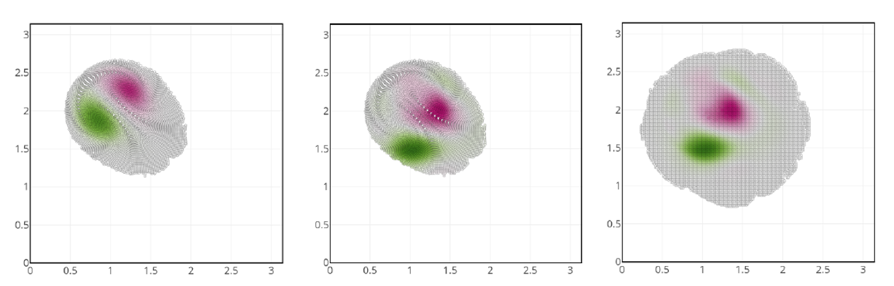

## Introduction

### Le broyeur à boulet pour la fabrication du MOX

Nous nous intéressons à l'étape de mélange-broyage dans le procédé de fabrication du MOX à l'aide du broyeur à boulet.
Un mélange d'oxyde d'uranium, d'oxyde de plutonium et de chamotte est concassé dans un broyeur à boulet.
Ce dispositif cylindrique, rempli de boules de broyage, met en oeuvre un processus de rotation pour broyer finement le mélange de poudres d'oxyde. Sa performance est critique pour la qualité du produit final et sa sûreté d'utilisation dans les réacteurs nucléaires.

### Le jumeau numérique

Le jumeau numérique est une réplique virtuelle d'un système physique, permettant de simuler, d'analyser et de prédire le comportement du système physique en temps réel. Ce modèle numérique intègre des données dynamiques et historiques, permettant une représentation précise et **synchronisée** dans le temps. Dans le contexte industriel, les jumeaux numériques utilisent l'**intelligence artificielle** (IA), l'analyse de données, et les capteurs physiques pour améliorer la compréhension des processus et faciliter la prise de décisions.

### Apport du jumeau numérique pour le broyeur à boulet

#### Apport 1 : compréhension du procédé

Le jumeau numérique permet de comprendre les phénomènes se déroulant à l'intérieur du broyeur à boulets, sans avoir à l'ouvrir. Il permet ainsi d'extraire de l'information quant aux mécanismes se déroulant lors de la comminution.

#### Apport 2 : optimisation du processus de broyage

Le jumeau numérique du broyeur à boulets permet d'analyser et de simuler le processus de broyage en temps réel. Il peut prédire l'efficacité du broyage, le degré de mélange des matériaux, et les impacts des variables opérationnelles comme la vitesse de rotation et le taux de remplissage des boules. Cela aide à optimiser les paramètres de fonctionnement pour obtenir un mélange homogène et efficace. En particulier, un **apprentissage par renforcement** permet de construire un modèle capable d'optimiser les paramètres du procédé en temps réel.

#### Apport 3 : maintenance prédictive

En surveillant l'état du broyeur à boulets, le jumeau numérique peut prédire les besoins de maintenance avant que les défaillances ne surviennent. Cela réduit les temps d'arrêt imprévus, augmente la durée de vie de l'équipement et assure une production continue et fiable.

#### Apport 4 : contrôle de la qualité du produit

La précision du jumeau numérique dans la modélisation du processus de broyage aide à garantir que le combustible MOX répond aux normes de qualité attendues.

### Défis associés à la construction du jumeau numérique

#### Défi 1 : données physiques

La première difficulté réside dans la collecte des données physiques. Le broyeur à boulets étant un système complexe, il nécessite un suivi détaillé des paramètres tels que la vitesse de rotation, des mesures acoustiques, ou d'un champ de vitesse. La collecte de ces données en temps réel et de manière fiable est cruciale pour assurer la représentativité du jumeau numérique.

#### Défi 2 : modélisation et simulation numérique

Le deuxième défi est la modélisation précise du broyeur à boulets. Ce processus nécessite une compréhension approfondie des mécanismes du broyage. La création de modèles numériques qui capturent fidèlement ces phénomènes est complexe et exige une expertise en mécanique. De plus, pour une utilisation en temps réel, ces modèles doivent être suffisamment efficaces pour permettre de suivre le procédé. Ce problème de rapidité de calcul peut néanmoins être évité par l'utilisation d'un **métamodèle**.

#### Défi 3 : assimilation de données (data assimilation, DA)

Le dernier défi concerne l'intégration des données réelles dans les modèles numériques. La DA implique l'ajustement des modèles basés sur les données physiques collectées, pour améliorer leur précision et leur fiabilité. Cela nécessite des algorithmes avancés capables de traiter de grandes quantités de données, souvent hétérogènes, tout en gérant les incertitudes et les erreurs inhérentes aux mesures. Le développement de ces algorithmes doit tenir compte des spécificités du processus de broyage dans le contexte du MOX, ce qui représente un véritable défi en matière de fusion de données et d'apprentissage automatique.

La construction d'un jumeau numérique pour un broyeur à boulets dans la fabrication du MOX est une **activité multidisciplinaire**, exigeant une expertise en **modélisation et simulation**, en **expérimentation**, et en **sciences des données**.

### Données disponibles aujourd'hui

Deux types de données sont disponibles au SA3E pour alimenter ce modèle virtuel.

#### Mesures du champ de vitesse

Nous disposons de mesures du champ de vitesse capturées à travers la face avant d'un hublot transparent. Ces données offrent un aperçu direct du comportement dynamique des matériaux à l'intérieur du broyeur, permettant notamment d'observer le profil d'écoulement du mélange et le champ de vitesse du mélange.

#### Mesures acoustiques

L'analyse du son émis par le broyeur peut révéler des informations sur divers aspects du processus, tels que les conditions de fonctionnement, les anomalies potentielles, ou encore l'usure des éléments du broyeur.

## Assimilation de données

La DA est un processus permettant d'intégrer des informations issues de différentes sources pour obtenir une compréhension plus précise et plus complète d'un système ou d'un phénomène. Cette méthode combine des données observées (mesures réelles) avec des prévisions issues de modèles numériques. L'objectif est de corriger et d'améliorer les modèles en fonction des observations, réduisant ainsi les incertitudes et améliorant la précision des prévisions.

Dans ce processus, les observations, qui peuvent être incomplètes ou entachées d'erreurs, sont confrontées aux prévisions du modèle au cours du temps. Le modèle est ensuite ajusté pour mieux correspondre aux données réelles. Il s'agit donc de résoudre un problème inverse en prenant en compte l'aspect dynamique du phénomène. Cette méthode est largement utilisée dans divers domaines tels que la météorologie, l'océanographie, la géophysique, et l'ingénierie environnementale. Par exemple, en météorologie, la DA est essentielle pour les prévisions météorologiques en intégrant des données satellites et des mesures au sol dans les modèles atmosphériques.

### Méthodes variationnelles

La méthode **3D-Var** (Three-Dimensional Variational Data Assimilation) est une méthode statique d'assimilation de données. Elle se concentre sur un seul instant, sans prendre en compte l'évolution temporelle du système. La fonction coût $J_{3D}(x)$ pour le 3D-Var est formulée comme suit :

$$J_{3D}(x) = \frac{1}{2}\|x-x_b\|_{B^{-1}}^2+ \frac{1}{2}\|y-H(x)\|^2_{R^{-1}}$$

où $x$ représente l'état du système, $x_b$ l'état de base ou ébauche (prévision du modèle), $B$ la matrice de covariance des erreurs de prévision, $y$ les observations, $H$ l'opérateur qui relie l'état du système aux observations, et $R$ la matrice de covariance des erreurs d'observation.

Dans la méthode 3D-Var, la minimisation de $J(x)$ conduit à un état optimal qui est une meilleure estimation de l'état réel du système à un instant donné, en tenant compte à la fois des erreurs dans les observations et dans la prévision du modèle.

La méthode **4D-Var** (Four-Dimensional Variational Data Assimilation) étend la méthode 3D-Var en incorporant une dimension temporelle. Cette approche considère non seulement l'état actuel du système mais aussi son évolution dans le temps. Elle cherche à minimiser la fonction coût sur une fenêtre temporelle, prenant en compte les observations et les prévisions à différents moments.

Dans la méthode 4D-Var, la fonction coût est similaire à celle du 3D-Var, mais elle intègre l'aspect dynamique du système. La minimisation de la fonction coût $J_{4D}(x)$ sur une fenêtre temporelle conduit à un ajustement des prévisions du modèle non seulement à un instant donné mais sur toute la période considérée. La fonctionnelle s'écrit

$$J_{4D}(x) = \frac{1}{2}\|x_0-x_{b,0}\|_{B^{-1}}^2 + \frac{1}{2} \sum_{t=0}^T \|y_t-H(x_t)\|^2_{R^{-1}}$$

La résolution du problème d'optimisation associée à l'approche 4D-Var pose une difficulté quant à la résolution du problème numérique. Celle-ci est résolue par un solveur itératif qui nécessite la modélisation et résolution d'un problème adjoint. Cette mise en oeuvre peut se révéler particulièrement fastidieuse.

Les méthodes 3D-Var et 4D-Var présentent une limitation notable : elles ne prennent pas en compte les incertitudes sur l'état assimilé. Dans ces approches, l'accent est mis sur la minimisation de la différence entre les observations et les prédictions des modèles, mais sans une estimation explicite ou une gestion des incertitudes associées à l'état du système après assimilation. Ce point peut impacter la confiance des prévisions.

### Filtre de Kalman

Le filtre de Kalman est une méthode algorithmique efficace pour estimer l'état d'un système dynamique en présence d'incertitudes. Il est largement utilisé dans divers domaines tels que le contrôle de processus, la navigation et le traitement du signal. Le filtre de Kalman est une approche séquentielle permettant de mettre à jour l'état estimé au cours du temps, au fur et à mesure que les observations sont collectées.

L'une des hypothèses fondamentales du filtre de Kalman est la linéarité. Le système est supposé être décrit par des équations linéaires, tant pour l'évolution de son état que pour la relation entre les mesures et l'état du système. Cette hypothèse de linéarité est cruciale pour l'application directe du filtre de Kalman, car elle simplifie significativement les calculs impliqués.

Une autre hypothèse clé est que les erreurs, à la fois dans le processus et dans les mesures, suivent une distribution gaussienne. Cette hypothèse permet de décrire entièrement l'incertitude par la moyenne et la covariance, rendant le traitement des incertitudes soluble.

L'équation du filtre de Kalman peut être présentée en deux étapes principales: la **prédiction** et la **mise à jour**. Dans la phase de **prédiction**, l'état actuel du système est estimé à partir de son état précédent. On prédit l'état futur à partir du code de calcul noté $F$ pour "Forward" :
$$
\begin{aligned}
x^{f} &= F x^{a},\\
P_k^f &= F P_{k-1}^a F^T + B,
\end{aligned}
$$
où $x^f$ est l'estimation de l'état à l'instant $k$ sachant l'information jusqu'à l'instant $k-1$, et $P_k^f$ est la covariance de l'estimation de l'erreur. $B$ est la covariance du bruit du processus. Les indices $f$ et $a$ indiquent respectivement les états prédits ("forecast") et assimilés ou analysés.

Dans la phase de mise à jour, l'estimation est affinée à l'aide des nouvelles mesures :
$$
\begin{aligned}
K &= P_k^f H^T (H P_k^f H^T + R)^{-1}\\
x^a &= x^f + K (y - H x^f)\\
P_k^a &= (I - K H) P_k^f
\end{aligned}
$$
Ici, $K$ est le gain de Kalman, $y$ est la mesure à l'instant $k$, $H$ est la matrice qui relie l'état aux mesures, $R$ est la covariance du bruit de mesure, et $I$ est la matrice identité. $P_k^a$ est la covariance mise à jour de l'erreur d'estimation.

En résumé, le filtre de Kalman fournit une méthode systématique pour intégrer de manière optimale les informations issues des mesures et des modèles dans des systèmes linéaires et gaussiens, offrant ainsi des estimations précises de l'état des systèmes dynamiques. Tout en fournissant une estimation de l'état d'un système, intègre intrinsèquement les incertitudes associées à cette estimation à travers la matrice de covariance $P_k^a$, reflétant ainsi la variabilité et l'imprécision inhérentes aux données et au modèle utilisé.

### Méthodes d'ensemble

#### Filtre Particulaire

Le filtre particulaire, également connu sous le nom de méthode de Monte Carlo séquentielle, est une technique d'assimilation de données non linéaire et non gaussienne. Il repose sur l'utilisation d'un ensemble de "particules" (échantillons) pour représenter la distribution de probabilité de l'état du système. Chaque particule est une réalisation possible de l'état du système, et sa probabilité est mise à jour en fonction des observations.

Bien que le filtre particulaire soit très flexible, notamment pour les systèmes non linéaires et non gaussiens, il présente des limites significatives en termes de temps de calcul, en particulier pour les systèmes de grande dimension. La nécessité d'un grand nombre de particules pour capturer correctement la distribution de l'état du système entraîne une augmentation considérable de la charge de calcul, rendant la méthode moins pratique pour des applications en temps réel ou pour des systèmes complexes.

#### Filtre de Kalman d'Ensemble (EnKF)

Pour surmonter les limitations du filtre de Kalman classique et du filtre particulaire, le filtre de Kalman d'ensemble (EnKF) a été développé. L'EnKF est une méthode d'assimilation de données qui utilise un ensemble de prévisions pour estimer l'état et les incertitudes d'un système. Contrairement au filtre de Kalman classique, qui est optimal pour des systèmes linéaires et des erreurs gaussiennes, l'EnKF est plus robuste quant aux non-linéarités et aux distributions non gaussiennes.

L'EnKF fonctionne en générant un ensemble de prévisions  (ou états) $(x_i^f)_{i=1}^N$ à partir du modèle. Chaque membre de l'ensemble est ensuite mis à jour indépendamment en utilisant les observations disponibles. Les équations de l'EnKF peuvent être présentées comme suit :

- **Étape de Prédiction** :
  $$x_i^f = F(x_i^a),$$
  où $x_{i}^{f}$ est la prévision du i-ème membre de l'ensemble, et $M$ est le modèle du système.

- **Étape de Mise à Jour** :
  $$x_{i}^{a} = x_{i}^{f} + K(y_{i} - h_i^f),$$
  avec $K$ le gain de Kalman, calculé comme :
  $$K = \text{cov}(x^f, h^f)(\text{cov}(h^f, h^f) + R)^{-1}$$
  où $\text{cov}$ est l'opérateur de covariance, $(h_i^f)_{i=1}^N$ est l'ensemble d'observations prédites, et $R$ est la covariance du bruit de mesure.

Dans l'EnKF, $x_{i}^{a}$ est l'état analysé (ou mis à jour) pour le i-ème membre de l'ensemble, et $y_i$ représente les observations. Cette méthode permet de capturer la distribution de probabilité de l'état du système de manière plus efficace et avec moins de charge de calcul que le filtre particulaire, surtout dans les systèmes de grande dimension.

Cette version de l'EnKF est parfois appelé EnKF stochastique car les observations $y_i$ correspondent aux données mesurées bruitées, i.e. $y_i = y + \varepsilon_i$ où $\varepsilon_i$ correspond au bruit de mesure. Ce bruit numérique permet de supprimer un biais statistique sur l'estimation de l'état.

## Simulation du tambour

### Méthode des éléments discrets (DEM)

La méthode des éléments discrets (DEM, pour Discrete Element Method) est une technique de simulation numérique utilisée pour étudier le comportement des systèmes de particules, tels que lors du mélange broyage à l'intérieur du broyeur à boulets. Cette approche est particulièrement pertinente pour modéliser les interactions complexes entre les particules dans ces systèmes, où la dynamique individuelle de chaque particule peut avoir un impact significatif sur le processus global.

Dans un mélangeur-broyeur, les particules interagissent entre elles, avec les parois du broyeur, et avec le corps broyant. La DEM modélise chaque particule individuellement, en tenant compte de ses propriétés physiques telles que la taille, la forme, la masse, la rigidité, et le modèle de fragmentation. Les interactions incluent les forces de contact, les forces de frottement, et les forces de cohésion.

Le processus de simulation DEM dans un mélangeur-broyeur commence par la définition des propriétés des particules et des conditions initiales du système. Le mouvement de chaque particule est ensuite calculé en résolvant les équations de Newton pour le mouvement et la rotation. Ces calculs tiennent compte des forces et des moments résultant des collisions et des interactions entre particules, ainsi que de l'interaction des particules avec les parois du broyeur.

L'un des principaux avantages de la DEM est sa capacité à fournir des informations détaillées sur le mélange et le broyage des particules à l'échelle microscopique. Elle permet d'analyser comment les variations dans la configuration des particules, la vitesse de rotation du broyeur, et d'autres paramètres opérationnels influencent l'efficacité du broyage et l'homogénéité du mélange.

Cependant, l'utilisation de la DEM pour la simulation de mélangeurs-broyeurs peut être exigeante en termes de ressources informatiques, en particulier pour les systèmes avec un grand nombre de particules.

### La DEM et la DA

L'assimilation de données, lorsqu'appliquée à des systèmes simulés par la méthode des éléments discrets (DEM), se heurte à plusieurs limites importantes présentées ci-dessous en plus du temps de calculs élevé pour des systèmes de grande taille.

#### Limites de la DEM avec les méthodes variationnelles

Dans le cadre des méthodes variationnelles d'assimilation de données, telles que 3D-Var et 4D-Var, le principal défi est la grande dimensionnalité du problème d'optimisation.

La DEM simule le comportement de chaque particule individuellement, ce qui signifie que l'état du système comprend la position et la vitesse de chaque particule. Pour un système avec des milliers voire des millions de particules, cela conduit à un problème d'optimisation de très grande dimension.

De plus, il existe un nombre extrêmement élevé de contraintes, notamment l'interdiction de l'interpénétration des particules. Ces contraintes doivent être prises en compte pour assurer que la solution d'optimisation soit physiquement admissible.

L'application des méthodes 3D-Var et 4D-Var est donc trop exigeante d'un point de vue des temps de calcul.

#### Limites de la DEM avec EnKF

Pour l'EnKF, l'état estimé du système est une combinaison linéaire des états prédits par les différents membres de l'ensemble. Cependant, dans le contexte de la DEM, cette combinaison linéaire des états n'est pas nécessairement physiquement admissible. Par exemple, elle pourrait conduire à des situations où les particules s'interpénètrent ou violent d'autres lois physiques.

Un autre problème avec l'EnKF dans le contexte de la DEM est la difficulté de faire correspondre les particules entre les différents membres de l'ensemble. Chaque particule a sa propre trajectoire unique, et aligner ces trajectoires à travers les différents membres de l'ensemble pour une assimilation de données cohérente est un défi complexe. Cette difficulté est exacerbée par le nombre élevé de particules et par la nature dynamique et chaotique de leurs interactions.

### Méthode des points matériaux (material point method, MPM)

La méthode des points matériaux (MPM) est une technique de simulation numérique innovante, particulièrement adaptée à la modélisation de phénomènes complexes comme ceux rencontrés dans les mélangeurs-broyeurs. Cette méthode représente un compromis entre les approches par éléments finis et par particules, offrant ainsi une modélisation efficace des interactions matérielles dans des environnements dynamiques et déformables.

Dans la MPM, l'intérieur du tambour d'un mélangeur-broyeur est conceptualisé comme un milieu continu, adoptant une perspective macroscopique. La réponse du milieu est alors représenté par une loi de comportement mécanique telle que la loi de Drucker-Prager. Cela contraste avec la méthode des éléments discrets (DEM), qui se concentrent sur les interactions particule-par-particule.

Le processus de simulation avec la MPM implique des itérations entre une grille de calculs et des particules matérielles. Chaque particule porte des informations essentielles associées au matériau, telles que la masse, le volume, et les propriétés mécaniques (variables internes, gradient de déformation...). Ces particules sont utilisées pour transférer des informations sur et hors d'une grille de calculs, où les équations de mouvement et de comportement du matériau sont résolues.

Cette approche hybride permet à la MPM de capturer efficacement les déformations importantes, les ruptures, et d'autres comportements complexes du milieu qui sont fréquents dans les opérations de mélange et de broyage. En revanche, la description fine du phénomène proposée par la DEM n'est plus disponible.

En termes de temps de calculs, la MPM est plus efficace que la DEM.

### La MPM et la DA

La MPM offre un cadre exploitable pour mettre en place une méthode de DA.
La structure de grille sous-jacente à la MPM permet une modélisation l'utilisation des méthodes variationnelles ou des méthodes d'ensemble. La structure de particules est aussi plus flexible dans le sens où elles représentent une densité de matière : elles peuvent donc s'interpénétrer.

#### MPM et méthodes variationnelles

Le principal défi est de gérer la dimension du problème d'optimisation pour la 3D-Var, ainsi que construire un modèle adjoint pour la 4D-Var.
Deux pistes sont envisageables : mettre à jour les champs nodaux et les champs particulaires. Comparativement à la DEM, le nombre de variables et le nombre de contraintes sont drastiquement réduits au prix d'une représentation plus grossière.

#### MPM et EnKF

Pour l'EnKF, l'état estimé est une combinaison linéaire des états prédits. Dans le contexte de la MPM, cela signifie que la mise à jour de l'état peut être directement effectuée sur la grille de calcul, plutôt que sur les particules individuelles. Cette approche réduit la complexité des calculs et facilite l'assimilation de données dans des systèmes à grande échelle.

Cependant, l'intégration de la MPM avec l'EnKF soulève plusieurs questions importantes :

1. **Transfert d'Informations de Particules à la Grille** : La première question concerne le transfert efficace des informations des particules vers la grille. Cela nécessite des algorithmes précis pour garantir que les informations pertinentes sur les propriétés des matériaux, telles que la densité, la contrainte, et le gradient de déformation déformation, sont correctement représentés sur la grille de calcul.

2. **Remaillage de Particules pour Représenter l'État Mécanique** : Une autre question clé est de savoir comment effectuer un remaillage des particules pour représenter fidèlement l'état mécanique du système après assimilation. Cela est crucial pour maintenir la cohérence et l'exactitude du modèle MPM, en particulier après des mises à jour successives de l'état du système.

### Vortex-In-Cell : un modèle grille-particules simplifié

La méthode Vortex-In-Cell (VIC) est une technique de simulation numérique, considérée ici comme une version simplifiée de la MPM. Cette méthode est particulièrement utilisée pour simuler les écoulements de fluides et les dynamiques de vortex. La VIC combine l'utilisation d'une grille de calcul avec des particules pour modéliser le mouvement des fluides.

Dans la méthode VIC, la grille sert de structure pour effectuer les calculs numériques liés à la dynamique des fluides, tandis que les particules, dispersées dans le fluide, transportent une quantité scalaire, la vorticité. Cette approche diffère de la MPM dans le sens où les particules portent des informations complexes sur les propriétés mécaniques du matériau.

Le processus de simulation avec la VIC implique d'abord le calcul des champs de vitesse sur la grille. Ces champs sont ensuite utilisés pour déplacer les particules dans le fluide, qui à leur tour transportent la vorticité à travers le domaine de simulation. L'avantage de cette méthode est sa capacité à modéliser avec précision les phénomènes complexes d'écoulement de fluides, tels que la formation et l'évolution de tourbillons, tout en maintenant une structure de calcul relativement simple.

## La thèse de Marius Duvillard

Pour aborder efficacement l'assimilation de données avec la MPM, il est essentiel de maîtriser d'abord l'assimilation de données dans des contextes plus simples, comme celui offert par la méthode VIC. Avec sa structure plus basique impliquant une grille de calcul et des particules transportant des quantités scalaires, l'approche VIC sert de préalable pour développer et affiner les techniques d'assimilation de données nécessaires pour des approches plus complexes comme la MPM.

À ce jour, deux méthodes principales ont été développées pour l'assimilation de données dans le cadre de la méthode VIC. Ces méthodes visent à intégrer efficacement les observations dans le modèle de simulation pour améliorer la précision et la fiabilité des prédictions.

### Remesh-EnKF

La première approche, nommée **Remesh-EnKF** (Remeshing Ensemble Kalman Filter), se concentre sur l'assimilation de données au niveau de la grille. Dans cette méthode, l'assimilation de données est effectuée en premier sur la grille. Ensuite, un maillage de particules est régénéré, ce qui permet de transférer les informations mises à jour de la grille vers les particules. Cette étape est cruciale pour maintenir la cohérence entre les données sur la grille et les caractéristiques physiques des particules. Enfin, un processus de troncature est appliqué pour éliminer les particules ayant une intensité trop faible, permettant ainsi d'optimiser les ressources de calcul et de conserver uniquement les particules significatives pour la dynamique du fluide.

### Part-EnKF

La seconde approche, appelée **Part-EnKF** (Particle Ensemble Kalman Filter), propose une stratégie différente en effectuant l'assimilation directement sur les intensités des particules, sans nécessiter de remaillage. Cette méthode met l'accent sur la mise à jour des caractéristiques des particules individuelles, en tenant compte de leurs intensités et positions. Contrairement à la Remesh-EnKF, la Part-EnKF évite les difficultés liées au remaillage de particules, en se concentrant uniquement sur la mise à jour des attributs des particules existantes.

### Comparaison des filtres proposés

Chacune de ces approches présente des avantages et des inconvénients. La Remesh-EnKF permet une intégration plus stable des informations de la grille et des particules, assurant une meilleure représentation des états assimilés. Cependant, le remaillage et le transfert de la grille vers les particules présentent un certain coût de calcul.

D'un autre côté, la Part-EnKF offre une plus grande efficacité en évitant le remaillage, mais peut manquer de précision dans la représentation des interactions complexes entre la grille et les particules comme illustré ci-dessous.

Si le support des particules de la prédiction ne correspond pas à la solution assimilée, le filtre peut prédire un état nul.

Ces méthodes d'assimilation pour la VIC posent des bases nécessaires pour aborder des techniques d'assimilation de données plus complexes comme celles requises par la MPM.

## Perspectives envisagées

### Perspectives de DA avec la MPM

L'application des approches Remesh-EnKF et Part-EnKF à la méthode des points matériaux (MPM) représente une évolution logique et prometteuse dans le domaine de l'assimilation de données pour les simulations numériques complexes. Ces méthodes, ayant fait leurs preuves dans le cadre de la méthode VIC, offrent un cadre robuste et flexible pour l'intégration des observations dans les modèles de simulation.

La prochaine étape consisterait à adapter et à mettre en oeuvre la méthode Remesh-EnKF dans le contexte de problèmes MPM relativement simples, notamment ceux impliquant des matériaux élastiques. Cette première étape permettrait de limiter la complexité et le nombre d'informations à mettre à jour, rendant le processus d'assimilation plus facilement gérable et offrant une opportunité de valider l'approche dans un cadre MPM.

Ensuite, il serait essentiel d'étendre l'application de Remesh-EnKF à des lois de comportement mécanique plus complexes, telles que la loi de Drucker-Prager ou la loi de Mohr-Coulomb, qui sont particulièrement adaptée à la modélisation de poudres et d'autres matériaux granulaires. La loi de Drucker-Prager est par ailleurs utilisée pour les simulations de pressage au CEA.

Par ailleurs, l'implémentation de l'assimilation de données dans le contexte d'un tambour de mélangeur-broyeur, en intégrant le champ de vitesse, constituerait un défi supplémentaire mais nécessaire. Cela implique la prise en compte des dynamiques au sein du tambour, y compris les interactions entre particules et avec les surfaces du tambour.

En termes logiciels, une collaboration pourrait se mettre en place avec Vincent Richefeu (UGA), auteur de Rockable. Ce dernier a développé un code de simulation MPM couplé avec Rockable qu'il a déjà officieusement partagé avec le CEA.

### Perspectives de DA avec la DEM

Avec le recul des travaux de Marius, nous avons identifié une solution pour faire de la DA avec la simulation DEM.

[Comme évoqué auparavant](#la-dem-et-la-da), les méthodes variationnelles posent des difficultés majeures en raison du grand nombre de dimensions et de contraintes impliquées. Chaque particule dans la DEM a sa propre position, vitesse, et éventuellement d'autres attributs physiques, ce qui crée un espace d'état de très grande dimension. De plus, il y a des contraintes physiques cruciales à considérer telles que l'interdiction de l'interpénétration des particules. La gestion de ces contraintes dans un problème d'optimisation de grande dimension rend l'application des méthodes variationnelles extrêmement complexe et coûteuse.

Une façon d'éviter ce problème de grande dimension serait de corriger la position des particules à travers un champ de force optimal. L'état assimilé $x^a_p$ de la particule $p$ pourrait être recherché sous la forme
$$
m_p \ddot x_p = F^{DA}_p + g + \sum_{q\ne p} F_{q\to p},
$$
où les forces $F_{q\to p}$ correspondent aux forces d'interactions entre particules, $g$ est la force de gravité, et $F^{DA}_p$ est une force résultante du problème d'assimilation. Une fois cette nouvelle force définit, le code DEM garantit naturellement les contraintes physiques en boîte noire.

Un développement de Taylor de la position à l'ordre 2 donne
$$
\begin{aligned}
x_p(t+\Delta t) &\approx x_p(t) + \dot x_p(t) \Delta t + \frac{1}{2} \Delta t^2 \frac{F(t)}{m_p}, \\
\dot x_p(t + \Delta t) &\approx \dot x_p(t) + \Delta t \frac{F(t)}{m_p}.
\end{aligned}
$$
On pourrait alors introduire cette formulation dans la fonctionnelle associée à la méthode [3D-Var](#méthodes-variationnelles) et obtenir
$$
\tilde J(F^{DA}) =
\frac{1}{2}\left\|F^{DA}\right\|_{B^{-1}}^2 +
\frac{1}{2}\left\|y-H\left(x_p(t+\Delta t), \dot x_p(t+\Delta t)\right)\right\|^2_{R^{-1}}.
$$
Si un algorithme peut être mis en place, le déploiement dans le code DEM existant est peu intrusive, dans le sens où un champs de force doit être ajouté aux forces existantes pour trouver la solution assimilée.

Une version simplifiée est envisagée pour la 3e année de la thèse de Marius Duvillard. Il s'agit de définir un champ de vitesse pour corriger la position des particules dans les simulations VIC. Cette méthode correspond à un développement de Taylor de la position à l'ordre 1. Elle a l'avantage de traiter un problème modèle simplifié et de s'inscrire dans la continuité des développements de Marius.

## Perspective suggérée : DA et IA pour le développement d'un capteur logiciel pour le procédé de mélange-broyage

Cette approche propose de s'affranchir des modèles physiques pour effectuer la DA.

L’objectif principal est de proposer une approche novatrice alternative capable d’estimer les propriétés du milieu granulaire à haute fréquence, telles que l’indice de mélange ou la granulométrie. Il s’agira d’apprendre le lien direct entre les capteurs physiques et les propriétés matériaux basé sur un modèle d’apprentissage, en évitant l’estimation de l’état interne du procédé. Ce lien sera effectué par un capteur logiciel (ou "soft sensor") qui fera la prédiction des propriétés de la poudre à partir des données de capteurs physiques.

L'approche diffère du jumeau numérique classique dans le sens où les **propriétés mécaniques globales** de la poudre seraient estimées en temps réel. L'état interne du tambour est ignoré et traité comme une variable de nuisance au sens statistique, c'est-à-dire qu'il ne présente pas d'intérêt en soit mais est nécessaire pour estimé l'état de la poudre.

Les capteurs physiques à disposition devront être simulables par une méthode telle que la DEM, la MPM, ou autre. Deux capteurs simulables sont d’ores et déjà disponibles. Le premier concerne la mesure de champs de vitesse du milieu sur la face avant du tambour, tel que réalisée au DEC/SA3E. Les champs de vitesse peuvent être simulé par les méthodes DEM et MPM. Le second capteur concerne la mesure de signaux acoustiques des tambours rotatifs. Cette dernière mesure a été modélisée par une approche DEM dans Li et al. 2021.

Une fois les capteurs physiques d’intérêt identifiés, une base de données synthétiques devra être construite. Celle-ci proviendra des simulations définies au préalable, et contiendra une table de correspondance entre différents états de la poudre et données de capteurs.

Cette base de données sera utilisée par la suite pour construire un **réseau de neurones récurrent** (recurrent neural network, RNN). Ce dernier possède la particularité d’avoir un état interne dynamique qui peut facilement être mise à jour par un filtre de Kalman d’ensemble.

Les capteurs instrumentant les bancs d’essais fournissent des données sous forme de séries temporelles corrélées. Ces sorties diffèrent de la simulation pour trois raisons principales : les phénomènes physiques négligés durant la modélisation, la méconnaissance de l’état du système réel sur lequel la mesure est faite, et le bruit issu des capteurs de mesures. Ces travaux adresseront la représentation de l’erreur entre la simulation et les données (incluant erreur de modèle, imprécision de calibration et erreur de mesure).

Enfin, la maîtrise des incertitudes sur l’état du combustible est le dernier verrou à aborder. Des stratégies d’implantation et de choix de capteurs instrumentant le procédé seront élaborées en s’appuyant sur la simulation. Ces capteurs (accéléromètres, capteurs acoustiques, courant moteur, …) seront sélectionnés et positionnés afin de maximiser la robustesse de l’estimation de l’état réel du système.

## Conclusions

Comme présenté dans ce document, la construction du jumeau numérique est une activité multi-disciplinaire alliant l'expérimentation, la modélisation, les probabilités et statistiques, et l'intelligence artificielle. Les technologies développées dans ces domaines peuvent essaimer, et des synergies peuvent être trouvées avec les autres activités du DEC.

Par exemple, l'approche de métamodélisation par IA, en particulier l'**apprentissage profond**, a été exploitée par le DEC/SESC/LDOP et DEC/SESC/LMCP dans le cadre de couplage entre la diffusion et la thermochimie pour simuler l'amorce de fusion du combustible. Des travaux sont en cours afin de construire une confiance dans la prédiction du **réseau de neurones**.

Les **méthodes statistiques** de résolution des problèmes inverses ont aussi été mises en place lors d'une collaboration entre DEC/SA3E et DEC/SESC pour l'estimation de la diffusivité thermique par microscopie infra-rouge avec la plateforme CHARTREUSE. L'approche permet en particulier d'estimer les incertitudes sur la quantité d'intérêt. Afin de raffiner l'estimation de la diffusivité, un modèle éléments-finis a été construit récemment. Le couplage de ce dernier avec les approches statistiques pour l'estimation nécessite la construction d'un métamodèle par **apprentissage automatique**.  La méthodologie est directement transférable aux essais de flash-laser.
