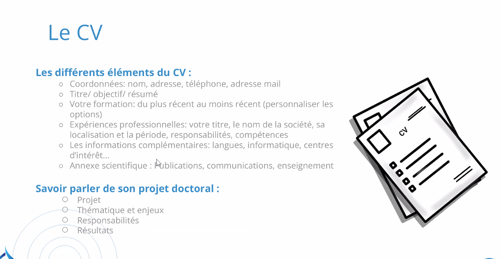
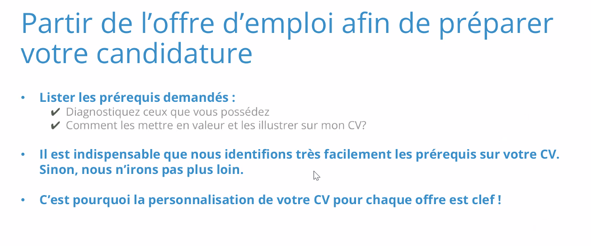
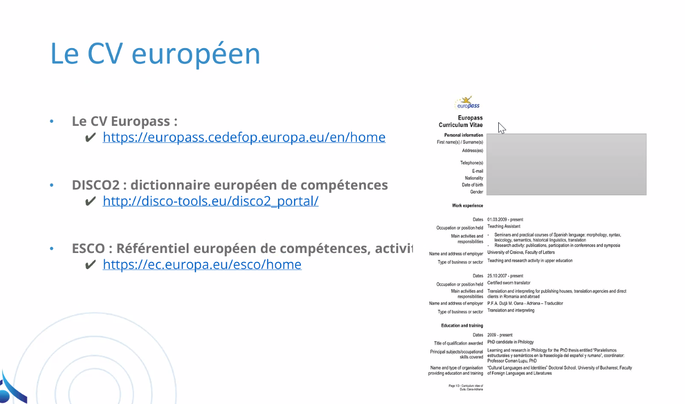

# Notes formation débouchés thèse

- Présenté par `Adoc talent management` pur le recrutement des doctorants
- Ils ont un laboratoire LID (labo interdisciplinaire du doctorat)
- Ils sont à Montréal et à Bruxelles
- Présenté par Yamina Cauvin (Paris)
- Définir projet professionnel
  - Mes compétences et qualités (savoir = connaissance / savoir-faire = compétence pratique / savoir-être)
  - Mes aspirations, mes motivations: ce que je veux faire
  - Attentes du marché: comment le marché marche
- Innovation est une valeur concurrentielle

- clture d'entreprise: identité de la boite (codes, culture et valeurs). Voir les valeurs de l'entreprise et ses valeurs personnelles.Voir les photos d'équipe par exemple. Poser la question si pas d'info.
- Le secteur est dans le "ce que je veux" = public, privé, social
- Voir le code APE ou code NAF

- définir pour un poste: missions, puis activités, puis compétences.
- Sur le CV
  - Titre: titre du poste, 2-3 lignes de présentation. Formations, expériences. Mettre le doctorant en avant dans les deux rubriques. Mettre publication et communication.
  - Faire le CV en anglais aussi

- parler de son projet professionnel
  - Projet ?
  - Thématique et enjeux 
  - Responsabilités
  - Résultats

Je vise un poste d'ingénieur-chercheur dans une entreprise de recherche national

Bonjour madame, Marius Duvillard, je me permet de vous contacter car j'ai vu l'offre que vous proposiez comme ingénieur-chercheur dans votre entreprise.

Parcours:
- Après une formation initiale d'ingénieur généraliste à l'école de Nantes, curieux de découvrir le monde de la recherche, je me suis orienté vers une thèse en Mathématiques appliquées en collaboration entre le CEA et l'école polytechnique. Mon objectif était d'approfondir deux thématiques centrale dans mon cursus: l'utilisation de méthodes numérique pour la mécanique et le traitement de données. Au travers de ma thèse, j'ai pu développer des méthodes d'assimilation de données pour combiner les

Compétences:
- J'ai pu être confronté à la réalité du monde de la recherche, ce qui m'a permis de dvlp des compétences d'amnégation, de rigueur, et d'autonomie. Mais aussi nourrir ma culture scientifique au travers des échanges que cela soit au cours de séminaires conférences et auprès de mes collègues chercheurs.

Quelles épines lui enlever du pied:

- Les problématiques évoquées dans votre offre ...
  
mail: cauvin@adoc-tm.com