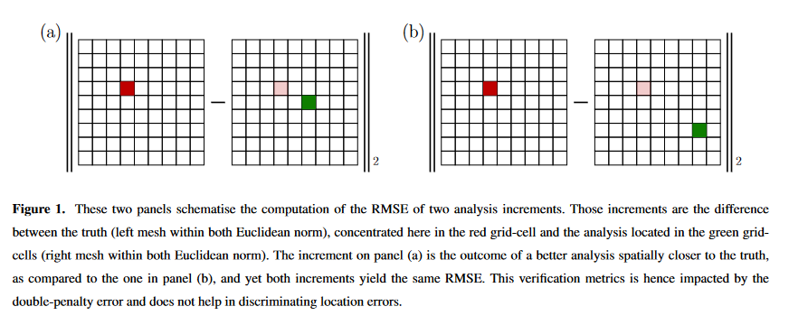

Dans cette partie nous reprenons ce qui existe en terme d'utilsation de l'OT pour l'assimilation de données. Cela se base sur différents articles et thèse. Tout d'abord l'article de *Bocquet et al. 2023* qui présente l'OTDA comme des approches interpolante en déplacement dans l'état physique tandis que les approches classiques vont interpoler dans l'espace des intensités.

Il y a ensuite les travaux de Feyeux pour qui utilise une distance de Wasserstein pour l'assimilation de données issues d'images.

Egalement les travaux de Ravela 2007 peuvent trouver une résonnance dans une approche OT via une étape d'alignement de champs.

Un travail de W.Steven Rosenthal Displacement data assimilation et al. 2017 trouve de similarités avec notre problématique de Vortex.

## Bocquet, Marc, Pierre Vanderbecken, Alban Farchi, Joffrey Dumont Le Brazidec, et Yelva Roustan. Bridging classical data assimilation and optimal transport, 2023.

**https://doi.org/10.5194/egusphere-2023-2755.**

Il rappelle tout d'abord que DA est critique pour des systèmes chaotiques pour mettre à jour les conditions initiales, estimer les paramètres physiques et statistique du modèle et permet de réanalyser l'histoire passée (smoothing).
Ils présentent deux faiblesses à l'AD outre les hypothèses sur les distributions d'erreur.

- *the double-penalty error*, La DA classique en sciences géophysiques présente une faiblesse majeure appelée "erreur de double pénalité". Cela se produit lorsque les erreurs du modèle et des données observationnelles sont surpénalisées, compromettant l'équilibre nécessaire. Par exemple, un léger déplacement de polluants peut entraîner des prédictions élevées là où aucun polluant n'est observé (voir image), créant des difficultés d'évaluation du modèle. Cette erreur est répandue dans les géosciences, affectant la prévision météorologique, la chimie atmosphérique, la prévision océanique, etc. L'utilisation de l'erreur quadratique moyenne aggrave ce problème, entravant l'apprentissage efficace des modèles. C'est une composante dominante à l'erreur de représentativité.
  

- La mise à jour de la DA classique peut être limitée à l'espace des valeurs des champs, ce qui entraîne une analyse confinée aux limites de l'état de fond et des observations. Ceci devient une lacune majeure lorsque le désaccord entre les observations et l'état de fond résulte d'une erreur de localisation des champs ou d'une mauvaise spécification générale de ces champs. La Figure 2 illustre des expériences de DA classique avec des analyses bénéfiques et inutiles.
  
  
On peut considérer que l'erreur provient du choix du RMSE comme mesure d'erreur, qui est une mesure localisé à une position. Une mesure plus intelligente consiste en la combinaison d'une carte de déplacement suivi de la norme classique RMSE (Hoffman et al., 1995; Keil and Craig, 2009). Des métriques basées sur des approches on pu être proposées.
Une approche élégante consiste à appliquer la théorie du *transport optimal* qui est associée à la *distance de Wasserstein*.
Des exemples d'utilisation d'OT peuvent être trouvé chez *Farchi et al. (2016)* et *Vanderbecken et al. (2023)*.

Posons quelques notations pour le transport optimal. Le problème consiste à trouver le plan au cout minimal de transporte la mesure $\rho_0$ à $\rho_1$. Mesures donc non négative et d'intégrale à 1. Un choix d'intégral peut être aussi écrit. De plus, des généralisations pour des masses différentes ont également été faites.

On défini un coût défini pour tout couple de point $(x,y) \in \Omega^2$ généralement fonction de la distance, on présente le coût quadratique

$$
\mathcal C_{bo}(x,y) = \norm{x-y}^2.
$$

On introduit l'ensemble des plans de transformations différentiables admissibles $T$

$$
\mathcal U_{bo} = \{T:\Omega \mapsto \Omega, \quad \rho_0 = |\partial_x T| \rho_b \circ T\}, 
$$où $|\partial_x T|$ est le déterminant de la jacobienne de $T$ qui prend compte de la déformation de la mesure par la conservation totale de la masse.

On peut alors définir le carré de la distance de *Wasserstein* comme

$$
\mathcal{W}^2_{\mathcal{C_{bo}}}(\rho_0, \rho_1) = \min_{T \in \mathcal U_{bo}} \int_{\Omega} \mathcal C_{bo}(x,T(x)) \rho_0(x)dx,
$$
Dont le but est de minimiser le cout total de transport d'une mesure à l'autre. D'un point de vu pratique, il n'est pas possible de résoudre le problème formuler avec un plan de transport déterministe comme énoncé par Monge. Kantorovitch introduit une formulation probabiliste au $XX^e$ siècle. Le plan de transport est remplacé par une mesure de probabilité $\pi$ définie sur $\Omega \times \Omega$.

L'espace des transformations admissibles devient

$$
\mathcal V_{bo} = \{\pi : \Omega \times \Omega \mapsto \mathbb R^+, quad \rho_o(x) = \int_\Omega \rho_b(y) \pi(x, y) dy, \quad \rho_b(y) = \int_\Omega \rho_o(x) \pi(x, y) dx\}.
$$

La distance de Wasserstein au carré devient alors

$$
\mathcal{W}^2_{\mathcal{C_{bo}}}(\rho_0, \rho_1) = \min_{T \in \mathcal V_{bo}} \int_{\Omega \times \Omega} \mathcal C_{bo}(x,y) \pi(x, y) dxdy.
$$

### Non local, multiscale metrics and DA

On trouve des métriques sur l'erreur de déplacement ont pu être introduite par Ravela et al. (2007); Plu (2013). De même des approches multiéchelles Ying (2019); Ying et al. (2023).
On trouve des formes proches de la distance de Wasserstein développées pour transporter la distribution du prior vers le posterior (El Moselhy and Marzouk, 2012; Oliver, 2014; Marzouk et al., 2017; Farchi and Bocquet, 2018; Tamang et al., 2020). On peut l'utiliser aussi pour ajuster les poids du filtre particulaire (Tamang et al., 2021, 2022). Elle a également été utilisée pour comparer des ensembles de forecast (Le Coz et al., 2023; Lledó et al., 110 2023), or precipitation (Duc and Sawada, 2023).
Aujourd'hui on ne traite que des cas de pdf de variables aléatoires scalaire. A cause du problème du fléau de la dimension.
Dans notre cas, on traite des états qui sont des champs, pas la pdf d'une seule variable. Dans les cas de champs de dimension 2 ou 3.

Le papier actuel se focalise plutôt en l'utilisation de la distance de Wasserstein lors de la formulation variationelle de l'analyse. 

On part ici de la fonction de coût du 3D-Var (avec la distance Euclidenne)

$$
\mathcal J_{cl}(\bx^a) = \norm{\by^b - \bx^a}^2 + \norm{\by^o -- \bH \bx^a}^2,
$$

où $\by^b$ est la prédiction du forcast, où $\by^o$ est le vecteur des observations.
En substituant la norme Euclidienne par la norme de Wasserstein on obtient la fonction de coût suivante

$$
\mathcal J_{w}(\bx^a) = \mathcal W_2^2(\bm y^b, \bx^a) +  \mathcal W_2^2(\bm y^0, \bH \bx^a).
$$ 

Il est nécessaire d'équilibre les deux distances. On appelle l'état d'analyse le *barycentre de Wasserstein*.

On remarque dans les travaux de Feyeux que cette formulation peut être inconsistente. Dans le cas où l'état est complètement observé ($\bH$ est l'identité), 'assimilation se déroule sans encombre. Un inconsistence s'observe lorsque l'état est partiellement observé. (Note: Dans notre cas, je pense que si l'observation est homogène alors tout va bien).

La principale raison à cela est de supposer que les densités d'origine et objectif ont la même masse. Ce qui s'applique pour les deux termes de calcul de distance de Wasserstein, à la fois que $m(\bx^a) = m(\by^b)$ et $m(\bH \bx^a) = m(\by^o)$. En supposant finalement que $m(\by^b) = m(\by^o)$, l'égalité $m(\bx^a)=m(\bH \bx^a)$ est difficilement atteignable pour $\bx^a \in \mathbb R^{N_a}\\text{ker(\bH)}$.
Il faut pour cela proposer une méthode qui puissent s'accomoder d'avoir des densités de masses différentes. Une résolution a été proposée par *Chizat et al. (2018)*. Ici une solution orientée DA.

## Proposition

Hypothèses: champs physiques non-négatifs, mais pas nécessairement l'ébauche et l'observation et $H$ est supposé linéaire.

Sur la partie 2.5

Ils ont introduit l'équation (18) dans leur papier qui est une nouvelle fonction coût

$$
L_w(\bx^a) = \min_{\bx^b \in \mathcal O_{N_b}^+, \bx^o \in \mathcal O_{N_o}^+} \{\zeta_b(\by^b - \bx^b) + \zeta_o(\by^o - \bH \bx^o) +W_{\bC_{ba}}(\bx^b, \bx^a) + W_{\bC_{oa}}(\bx^o, \bx^a)\}.
$$

Pour résoudre le problème, on utilise une version simplifiée. On ne se base que sur deux transferts différents $\bP^{ba}, \bP^{oa}$.
On régularise pour obtenir

$$
\begin{aligned}
\min_{\bx^b \in \mathcal O_{N_b}^+, \bx^o \in \mathcal O_{N_o}^+, \bx^a \in \mathcal O_{N_a}^+} [\zeta_b(\by^b - \bx^b) + \zeta_o(\by^o - \bH \bx^o) + W_{\bC_{ba}}(\bx^b, \bx^a) + W_{\bC_{oa}}(\bx^o, \bx^a) \\ 
+ \min_{\bP^{ba} \in \mathcal{U}_ba, \bP^{oa} \in \mathcal{U}_oa} \{\varepsilon \mathcal K (\bP^{oa}|\bv^{oa}) + \varepsilon \mathcal K (\bP^{ba}|\bv^{ba}) + \Tr(\bC_{oa}^T \bP^{oa}) + \Tr(\bC_{ba}^T \bP^{ba})\}].
\end{aligned}
$$

Avec les plans respectant les contraintes de conservation. 

On passe par la résolution du problème dual

$$
\mathcal J_{\varepsilon}^*  = \min_{\bf^b \in \mathbb{R}^{N_b}^+, \bf^o \in \mathbb{R}^{N_o}^+ \bf^a \in \mathbb{R}^{N_a}} (\bf^b, \bf^o, \bf^a),
$$
...